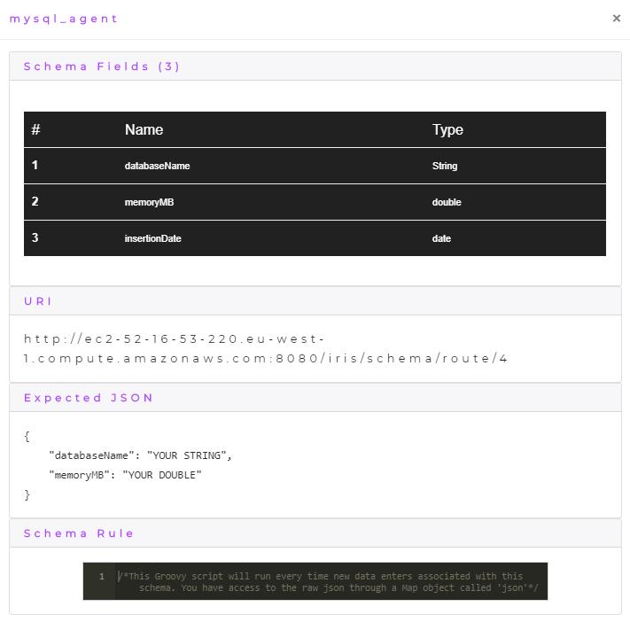
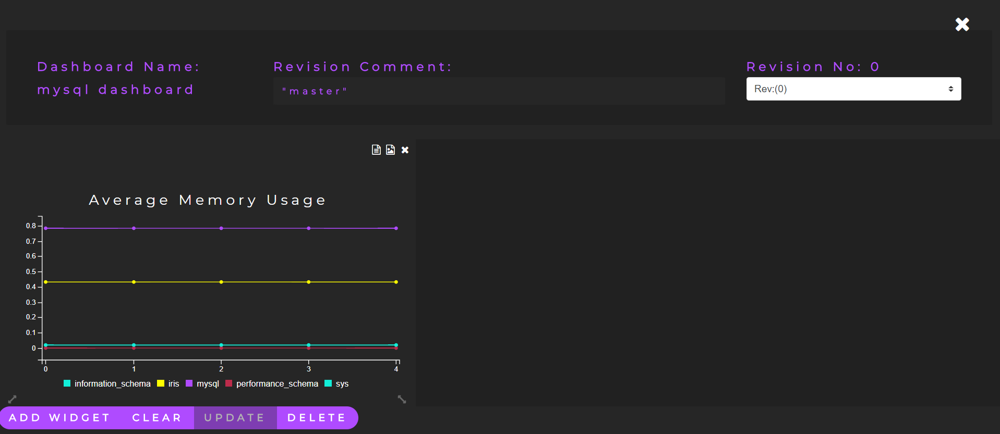

    

        
    

# Iris MySQL Agent

This repository contains the MySQL agent for my final year project [Iris](https://github.com/DeanGaffney/iris). This agent uses a python script to get the memory usage of a specific database. The memory usage and database name is then sent to Iris where it is displayed on a chart in real time. This agent was deployed on the same EC2 instance as the Iris web application and was run every day using cron to keep track of Iris' database memory.

## Agent Schema
The following is the schema that was created in Iris for the agent.

## Agent Dashboard
The following image shows the dashboard for the agent inside Iris where it is keeping track of the Iris database memory.

## Agent Transformation Rule
This agent has no transformation rule, please see the [Node.js Agent](https://github.com/DeanGaffney/iris-node) for an example of a transformation rule.

## Other Iris agents
* [Selenium](https://github.com/DeanGaffney/iris-selenium)
* [Node.js](https://github.com/DeanGaffney/iris-node)
* [Android](https://github.com/DeanGaffney/iris-android)
* [Crypto Currency Rates](https://github.com/DeanGaffney/iris-crypto-rates)

## Built With

- Python

## Authors

* **Dean Gaffney**

See also the list of [contributors](https://github.com/DeanGaffney/iris-mysql/graphs/contributors) who participated in this project.